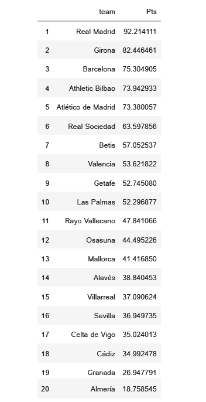

<h1>LaLiga 2023-2024 PREDICTION</h1>

Exciting news for football enthusiasts! I've been working on a personal machine learning project that predicts the final standings of the 2023-2024 La Liga season using Poisson regression. The outcome? A surprising prediction that awards the championship title to Real Madrid, despite the impressive performance of Girona throughout the season.

<h1>LIBRARIES USED</h1>

<strong>They are all available in the requirements.txt archive.</strong>

<ul>
    <li><code>pandas</code>: Data analysis.</li>
    <li><code>requests</code>: simplifies HTTP requests and responses.</li>
    <li><code>scipy</code>: scientific and technical computing.</li>
</ul>

<h2>Web Scraping and Data Exploration</h2>

Here we use Python's requests and pandas libraries to scrape and explore data from the Wikipedia page of La Liga's 2023-2024 season. The code fetches relevant tables, including the league table and game schedule, providing insights into team standings and match fixtures for the ongoing football season.

<h2>Team Names Mapping</h2>

This code snippet extracts team names and nicknames from the game schedule DataFrame of the La Liga 2023-2024 season. It then creates a dictionary (dict_teams) mapping team nicknames to their corresponding names, providing a handy reference for further analysis or visualization tasks.

<h2>Adjusted Game Schedule DataFrame</h2>

In this code snippet, we transform the original game schedule DataFrame for the La Liga 2023-2024 season. By setting the index, reshaping the DataFrame, and renaming columns, we create a more refined structure. Additionally, we leverage a pre-established dict_teams to replace team nicknames with their respective full names. The resulting game_schedule_adjusted DataFrame offers a clear and organized representation of match fixtures, distinguishing between home and away teams while excluding self-matches.

<h2>Completed and Upcoming Games Analysis</h2>

In this section of the La Liga 2023-2024 project, we further refine the game schedule by handling and categorizing completed and upcoming matches. The code intelligently fills missing results with "to play" and separates the DataFrame into two tables: completed_games_table, displaying past results, and upcoming_games_table, providing insights into future fixtures. These tables enhance the overall understanding of the league's dynamics throughout the season.

<h2>Completed Games Analysis: Goal Breakdown</h2>

In this segment of the La Liga 2023-2024 project, we delve into the completed games, extracting and analyzing the goal breakdown. The code splits the result column into home and away goals, converting them into integer format for a more precise evaluation. The resulting completed_games_table provides detailed insights into the scoring dynamics of past matches, contributing to a comprehensive understanding of team performances throughout the season.

<h2>Team Performance: Average Goals Analysis</h2>

In this part of the La Liga 2023-2024 project, we conduct an in-depth analysis of team performance by calculating average goals scored and conceded. The code generates home_goals_average and away_goals_average tables, shedding light on each team's offensive and defensive capabilities. This detailed breakdown enhances our understanding of team dynamics and contributes valuable insights to the overall narrative of the football season.

<h2>Team Statistics: Comprehensive Analysis</h2>

Here we consolidate team statistics by merging average goals scored and conceded for both home and away matches. The resulting statistics_table provides a comprehensive overview of each team's performance in terms of offensive and defensive capabilities. By offering a consolidated dataset, this analysis contributes valuable insights into the nuances of team dynamics throughout the football season.

<h2>Expected Points Calculation</h2>

In this segment of the La Liga 2023-2024 project, we introduce a function to calculate the expected points for each team based on a Poisson distribution model. The code defines calculate_expected_score to estimate the probabilities of home team victory, draw, and away team victory for upcoming matches. These expected points contribute to the ongoing analysis of team performance, providing valuable insights into the potential outcomes of future fixtures.

<h2>League Table Adjustment</h2>

This portion of the La Liga 2023-2024 project involves refining the league table by updating team names and converting points to integers. The code introduces the adjust_team_name function to align team names, ensuring consistency for further analysis. The resulting updated_league_table provides a cleaned and standardized representation of team standings, contributing to a more accurate interpretation of the league's dynamics.

<h2>Upcoming Games: Points Accumulation Analysis</h2>

In this section of the La Liga 2023-2024 project, we analyze the points accumulation for upcoming games. The code computes home_points_table and away_points_table, summing the expected points for each team based on the Poisson distribution model. These tables provide valuable insights into the anticipated performance of teams in the upcoming fixtures, contributing to a more comprehensive understanding of the league's unfolding dynamics.

<h2>La Liga 2023-2024 Updated League Table with Predicted Scores</h2>

In this segment of the La Liga 2023-2024 project, we refine the league table by updating scores based on anticipated performance in upcoming games. The code introduces update_prediction_score to recalculate total points for each team, incorporating the expected points from upcoming fixtures. The resulting updated_league_table offers an adjusted and predictive representation of team standings, providing valuable insights into the potential impact of upcoming matches on the overall league hierarchy.

<h2>HOW TO RUN THE CODE?</h2>

You'll need to download the libraries used, that are in the
    file "requirements.txt".

Create a virtual environment using the code 'virtualenv environment_name' in the terminal. After that, you must run 'pip install -r requirements.txt'. Doing that, all the configurations are now ready to make the automation work as it should.

<h2>La Liga 2023-2024 FINAL TABLE PREDICTED - 01/14/2024</h2>

